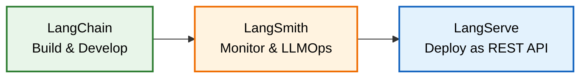
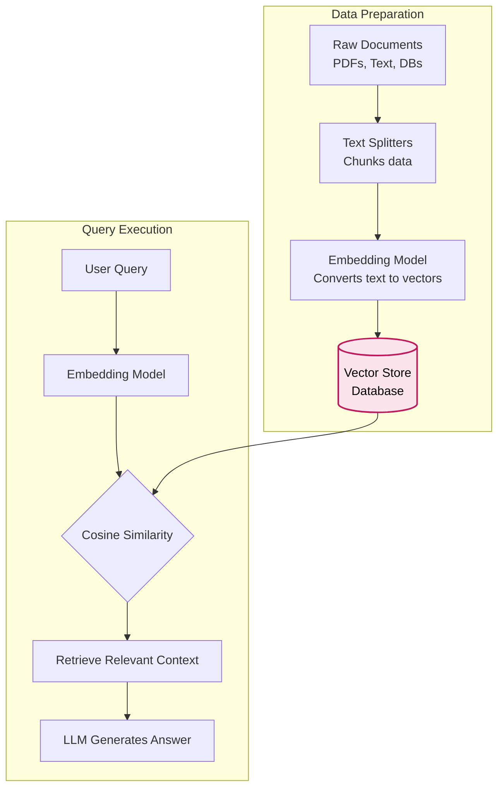

# Introduction to the LangChain Ecosystem

<h2 style="color: #2E86C1;">1. Why LangChain? The Problem and The Solution</h2>

Before LangChain, the Generative AI landscape was highly fragmented. The introduction of Large Language Models (LLMs) by companies like OpenAI, Hugging Face, Meta (Llama), and Google (Gemini) meant developers had to learn entirely different libraries, APIs, and documentation sets for each specific model.

*   **The Problem:** Accessing OpenAI required distinct API calls, while open-source models on Hugging Face relied on specific libraries like Transformers. Switching between models or combining them was incredibly difficult and time-consuming.
*   **The Solution:** LangChain emerged as a **common, open-source framework** designed specifically to build Generative AI applications. It standardizes development, allowing you to swap between paid and open-source models seamlessly using a unified syntax.

---

<h2 style="color: #27AE60;">2. The LangChain Ecosystem Lifecycle</h2>

The LangChain ecosystem encompasses the entire lifecycle of a Generative AI project, moving from initial development to monitoring and final deployment.

### I. LangChain & LangChain Community (The Building Blocks)
This core module provides access to multiple model integrations and the tools required to structure LLM inputs and outputs.
*   **Models:** Standardized access to OpenAI, Gemini, Llama, Hugging Face, etc.
*   **Prompt Engineering & Example Selectors:** Tools to dynamically format and select prompts before sending them to the LLM.
*   **Output Parsers:** Mechanisms to structure and customize the raw text response returned by the LLM.

### II. LangSmith (LLMOps & Monitoring)
Once an application is built, its performance must be tracked. LangSmith is the dedicated module for **LLMOps** (Large Language Model Operations).
*   **Key Capabilities:** Debugging complex application chains, evaluating model performance, continuous monitoring, prompt play-grounding, and data annotation.

### III. LangServe (Deployment)
Moves the application from a local development environment into production.
*   **Functionality:** Wraps LangChain runnables and chains into standard **REST APIs**.
*   **Hosting:** Prepares the APIs for deployment on cloud platforms like AWS or Hugging Face Spaces.

---

<h2 style="color: #8E44AD;">3. Data Ingestion and RAG Architecture</h2>

A critical component of LangChain is its ability to handle custom data for **Retrieval-Augmented Generation (RAG)**, which is essential for document Q&A and custom chatbots.

### Key Concepts in RAG:
*   **Document Loaders:** Connectors used to ingest data from amazing and varied external data sources.
*   **Text Splitters:** Break massive documents into manageable chunks that fit within an LLM's strict context window limit.
*   **Embeddings:** Transform plain text chunks into mathematical arrays (vectors) so machines can understand their semantic meaning. 
*   **Vector Stores:** Specialized databases that store these embeddings. When a user asks a question, the query is converted into a vector, and the database uses **cosine similarity** to retrieve the most relevant text chunks to feed to the LLM.