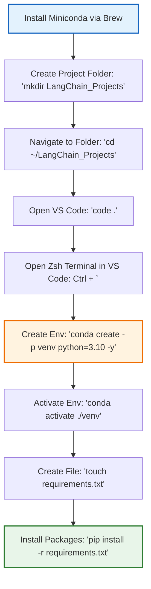

<h2 style="color: #2E86C1; border-bottom: 2px solid #2E86C1; padding-bottom: 5px;">1. Installing Conda on macOS</h2>

Before setting up your virtual environments, you need to have Conda installed. For Mac users, **Miniconda** (a lightweight version of Anaconda) is highly recommended. 

**Method: Using Homebrew (Recommended for Mac)**
If you have Homebrew installed, open your Mac Terminal (`Cmd + Space`, type "Terminal") and run:
```bash
brew install --cask miniconda
```

**Initialize Conda for your Zsh shell (Mac's default shell):**
```bash
conda init zsh
```
*Note: Restart your terminal after running this command to apply the changes.*

<h2 style="color: #2E86C1; border-bottom: 2px solid #2E86C1; padding-bottom: 5px;">2. Project Folder Organization</h2>

Before writing any code, it is crucial to organize your workspace to manage different generative AI projects efficiently.
*   **Main Workspace:** Create a single master folder in your Documents or Projects directory dedicated to the entire LangChain course.
*   **Sub-folders:** Create separate, dedicated folders inside the main directory for individual end-to-end projects to keep dependencies isolated.

<h2 style="color: #27AE60; border-bottom: 2px solid #27AE60; padding-bottom: 5px;">3. Launching VS Code (Mac Methods)</h2>

Visual Studio Code (VS Code) is the recommended IDE. You can open your project folder in VS Code using one of two methods on a Mac:

**Method 1: The UI Approach**
1. Navigate to your project folder in Finder.
2. Drag and drop the folder directly onto the VS Code icon in your Dock.

**Method 2: The Command Line Approach**
*Note: To use the `code` command on Mac, open VS Code, press `Cmd + Shift + P`, search for "Shell Command: Install 'code' command in PATH", and hit Enter.*
1. Open your Mac Terminal.
2. Navigate to your folder using the `cd` (change directory) command. 
   *(Example: `cd ~/Documents/LangChain_Projects`)*
3. Type the following and press Enter to launch VS Code in that directory:
```bash
code .
```

<h2 style="color: #8E44AD; border-bottom: 2px solid #8E44AD; padding-bottom: 5px;">4. Terminal Setup & Shortcuts in VS Code</h2>

Efficiency in VS Code comes from using shortcuts instead of navigating menus.
*   **Opening the Terminal:** Use the keyboard shortcut: **`Cmd + J`** or **`Ctrl + \``** (Control + Backtick).
*   **Selecting a Terminal Profile:** Mac defaults to **zsh**, which is the recommended terminal to use inside VS Code for these projects.

<h2 style="color: #D35400; border-bottom: 2px solid #D35400; padding-bottom: 5px;">5. AI Engineer Essentials: Virtual Environments & Dependencies</h2>

Because LangChain and AI libraries frequently update, you must create isolated virtual environments. This prevents library conflicts.

**Step 1: Create the Virtual Environment**
Create an environment in your current project folder (`-p venv`) and specify the Python version (highly recommended for AI projects to ensure compatibility):
```bash
conda create -p venv python=3.10 -y
```

**Step 2: Activate the Environment**
Activate the environment from the specific folder path:
```bash
conda activate ./venv
```

**Step 3: Creating a Requirements File**
AI engineers use a `requirements.txt` file to track dependencies. Create an empty file using the Mac `touch` command:
```bash
touch requirements.txt
```
*(You will manually add libraries like `langchain`, `openai`, `python-dotenv` to this file as you progress).*

**Step 4: Installing Dependencies**
Once you have libraries listed in your `requirements.txt`, install them all at once using pip:
```bash
pip install -r requirements.txt
```

**Step 5: Saving Current Dependencies**
If you installed packages manually via `pip install <package-name>` and want to save your current environment's state to a file:
```bash
pip freeze > requirements.txt
```

---

### Mac Workflow Visualization

