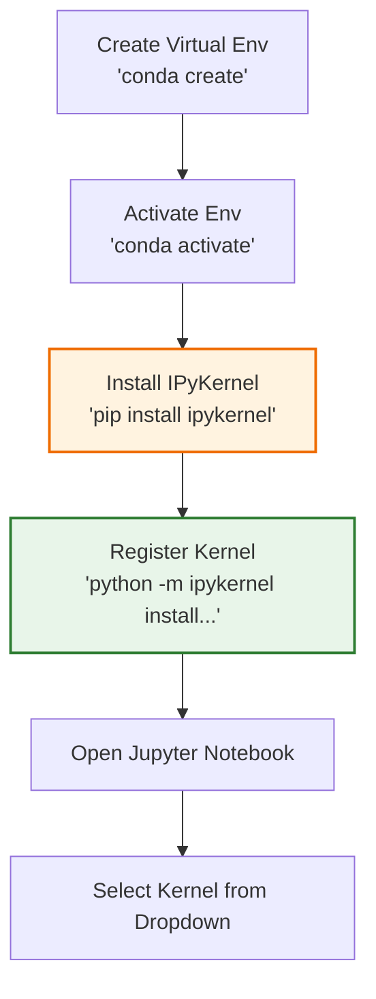

# IPyKernel Tutorial: The AI Engineer's Guide

As an AI Engineer, you will spend a significant amount of time experimenting in Jupyter Notebooks. However, AI projects often require vastly different dependencies (e.g., TensorFlow 2.x for one project, PyTorch with a specific CUDA version for another). 

**IPyKernel** is the bridge that allows you to connect your isolated virtual environments (like Conda or venv) to your Jupyter Notebooks. Without it, your notebooks will default to your system's base Python environment, leading to dependency conflicts.

<h2 style="color: #2E86C1; border-bottom: 2px solid #2E86C1; padding-bottom: 5px;">1. What is IPyKernel?</h2>

`ipykernel` is the Python execution backend for Jupyter. When you run a cell in a Jupyter Notebook, the notebook web interface sends the code to the kernel (IPyKernel in the case of Python), which executes the code and returns the output.

<h2 style="color: #27AE60; border-bottom: 2px solid #27AE60; padding-bottom: 5px;">2. The Standard AI Engineer Workflow</h2>

Whenever you start a new AI project, this is the standard workflow you should follow to ensure your Jupyter Notebook uses the correct dependencies.

### Step 1: Create and Activate your Virtual Environment
*(Assuming you are using Conda, as established in your Mac setup)*
```bash
conda create -p my_ai_env python=3.10 -y
conda activate ./my_ai_env
```

### Step 2: Install IPyKernel inside the Environment
You must install the kernel package *inside* your newly activated environment so it knows how to communicate with Jupyter.
```bash
pip install ipykernel
```

### Step 3: Register the Environment as a Jupyter Kernel
This is the most crucial step. This command links your current virtual environment to Jupyter, giving it a display name you will recognize.
```bash
python -m ipykernel install --user --name=my_ai_env --display-name="Python (My AI Project)"
```
*   `--name`: The internal reference name for Jupyter (no spaces).
*   `--display-name`: The human-readable name you will see in the Jupyter Notebook kernel dropdown menu.

### Step 4: Select the Kernel in VS Code or Jupyter Lab
When you open a `.ipynb` file in VS Code, click on the **Kernel Picker** in the top right corner. You should now see **"Python (My AI Project)"** in the list. Select it, and your notebook will now use the exact dependencies installed in `my_ai_env`.

<h2 style="color: #8E44AD; border-bottom: 2px solid #8E44AD; padding-bottom: 5px;">3. Managing Your Kernels</h2>

Over time, you will accumulate many kernels. You need to know how to list and delete them to keep your workspace clean.

**List all installed Jupyter Kernels:**
```bash
jupyter kernelspec list
```
*This will output a list of all kernels available to Jupyter and their file paths.*

**Remove/Uninstall a Kernel:**
When you finish a project and delete the Conda environment, the Jupyter kernel still hangs around as a "ghost" in your dropdown. You must manually remove it:
```bash
jupyter kernelspec uninstall my_ai_env
```

<h2 style="color: #D35400; border-bottom: 2px solid #D35400; padding-bottom: 5px;">4. Quick Reference Cheat Sheet</h2>

| Action | Command |
| :--- | :--- |
| **Install Package** | `pip install ipykernel` |
| **Add Kernel** | `python -m ipykernel install --user --name=env_name --display-name="Display Name"` |
| **List Kernels** | `jupyter kernelspec list` |
| **Remove Kernel** | `jupyter kernelspec uninstall env_name` |

---

### Workflow Visualization

