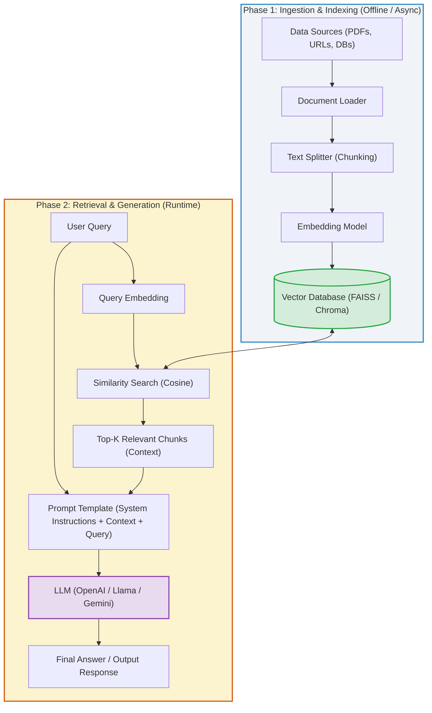

<h2 style="color: #2E86C1; border-bottom: 2px solid #2E86C1; padding-bottom: 5px;">1. High-Level Concept: What is RAG?</h2>

**Retrieval-Augmented Generation (RAG)** is an architecture designed to grant Large Language Models (LLMs) access to external, private, or real-time data sources without needing to retrain or fine-tune the model.

*   **The Challenge:** Standard LLMs have fixed knowledge cutoff dates and cannot access proprietary corporate data (e.g., thousands of internal PDFs, private databases, or live URLs). Moreover, passing entire document libraries directly into an LLM exceeds context length limits and incurs massive API costs.
*   **The RAG Solution:** Instead of feeding all data to the LLM at once, RAG retrieves only the most relevant passages matching the user's query from a vector database and injects those passages into the prompt context.

---

<h2 style="color: #27AE60; border-bottom: 2px solid #27AE60; padding-bottom: 5px;">2. Core Components: Phase 1 — Ingestion & Indexing</h2>

Before a user can query private data, the system must ingest, process, and index that data.

### Component 1: Data Ingestion (`DocumentLoaders`)
Data comes in many unstructured and semi-structured formats. LangChain provides specialized loaders to convert external data sources into standardized `Document` objects (containing raw text and metadata).
*   **Data Sources:** PDFs, Excel sheets, JSON, CSVs, raw text, web URLs, databases, and media files.

### Component 2: Data Transformation (`TextSplitters`)
LLMs have a fixed **Context Window** limit (maximum token capacity per request). Passing an entire book or 100-page PDF will fail or truncate.
*   **Role:** `TextSplitters` divide large documents into smaller, coherent units called **text chunks** (e.g., 500–1000 characters).
*   **Chunk Overlap:** A small overlap (e.g., 100 characters) between consecutive chunks is usually maintained so context is not lost across boundaries.

### Component 3: Text Embeddings (`Embeddings`)
LLMs and computers do not search text efficiently by keyword alone; they operate on numerical representations of meaning.
*   **Role:** Embedding models convert textual chunks into dense numerical vectors (arrays of floating-point numbers).
*   **Semantic Representation:** Text with similar mathematical meanings ends up close together in vector space.
*   **Providers:** OpenAI Embeddings (`text-embedding-3-small`), HuggingFace sentence-transformers, Google Gemini Embeddings.

### Component 4: Vector Store Database (`VectorStore`)
Once text chunks are converted into vectors, they must be stored in a specialized database optimized for high-dimensional spatial searches.
*   **Search Mechanism:** Uses algorithms like **Cosine Similarity** or **Euclidean Distance** to quickly locate vectors closest to a query vector.
*   **Popular Vector DBs:**
    *   *Local/In-Memory:* **FAISS** (Facebook AI Similarity Search), **ChromaDB**.
    *   *Cloud/Enterprise:* **AstraDB**, **Pinecone**, **Weaviate**, **Qdrant**.

---

<h2 style="color: #8E44AD; border-bottom: 2px solid #8E44AD; padding-bottom: 5px;">3. Core Components: Phase 2 — Retrieval & Generation</h2>

When a user submits a query, the retrieval and generation pipeline handles the real-time search and synthesis.

### Component 5: Prompt Templates (`PromptTemplate`)
System prompts guide the LLM's behavior, persona, and strict instructions (e.g., *"Act as a corporate AI researcher. Answer the user question ONLY using the provided context below. If you do not know, say 'I don't know'."*).

### Component 6: Retrieval Chain & Document Combination (`RetrievalChain`)
1.  **Query Vectorization:** The user's query string is converted into a vector using the exact same embedding model used during indexing.
2.  **Similarity Search:** The Vector DB retrieves the top-K most relevant text chunks (Context Info).
3.  **Stuffing Context (`create_stuff_documents_chain`):** The retrieved context chunks are "stuffed" into the prompt template alongside the original query.
4.  **LLM Generation:** The enriched prompt is sent to the LLM, which generates a precise, context-grounded response.

---

<h2 style="color: #D35400; border-bottom: 2px solid #D35400; padding-bottom: 5px;">4. End-to-End RAG Architecture Diagram</h2>

---

<h2 style="color: #C0392B; border-bottom: 2px solid #C0392B; padding-bottom: 5px;">5. Summary Checklist for AI Engineers</h2>

| Component | Responsibility | Key LangChain Module |
| :--- | :--- | :--- |
| **Document Loaders** | Read raw files into structured objects | `langchain_community.document_loaders` |
| **Text Splitters** | Slice text into context-friendly chunks | `langchain_text_splitters` |
| **Embeddings** | Translate text chunks into numerical vectors | `langchain_openai.OpenAIEmbeddings` / `HuggingFaceEmbeddings` |
| **Vector DB** | Index & quickly retrieve vector neighbors | `langchain_community.vectorstores` (FAISS, Chroma) |
| **Retrieval Chains** | Connect retriever, prompt, and LLM together | `create_retrieval_chain` / `create_stuff_documents_chain` |